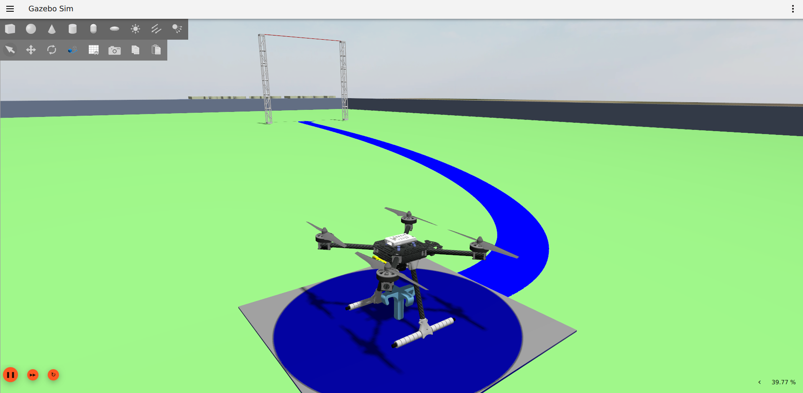

# Aerostack2 - Tutorial 

Documentação: [ReadTheDocs](https://aerostack2-tutorial.readthedocs.io/pt/latest/index.html)



## Build com Docker

**Tempo médio para o setup:** 45 min.

---

## Instalação do Docker Engine

<details>
<summary><b>Clique aqui caso precise instalar o Docker Engine.</b></summary>
<br>

Siga os passos abaixo para instalar o Docker Engine no Ubuntu.

Fonte: [Docker Engine Installation](https://docs.docker.com/engine/install/ubuntu/)

```bash
sudo apt-get update
sudo apt-get install ca-certificates curl
sudo install -m 0755 -d /etc/apt/keyrings
sudo curl -fsSL https://download.docker.com/linux/ubuntu/gpg -o /etc/apt/keyrings/docker.asc
sudo chmod a+r /etc/apt/keyrings/docker.asc
```

```bash
echo "deb [arch=$(dpkg --print-architecture) signed-by=/etc/apt/keyrings/docker.asc] \
https://download.docker.com/linux/ubuntu $(. /etc/os-release && echo "${UBUNTU_CODENAME:-$VERSION_CODENAME}") stable" | \
sudo tee /etc/apt/sources.list.d/docker.list > /dev/null
sudo apt-get update
```

```bash
sudo apt-get install docker-ce docker-ce-cli containerd.io docker-buildx-plugin docker-compose-plugin
```

---

## Executando Docker sem sudo

Após a instalação, configure o Docker para ser executado sem `sudo`.

```bash
sudo groupadd docker
sudo usermod -aG docker $USER
sudo reboot
```

Após reiniciar:

```bash
newgrp docker
```

---

## Instalação do NVIDIA Container Toolkit (Opcional)

Se você possui uma GPU da NVIDIA, siga esses passos.

Fonte: [NVIDIA Container Toolkit](https://docs.nvidia.com/datacenter/cloud-native/container-toolkit/latest/install-guide.html)

```bash
curl -fsSL https://nvidia.github.io/libnvidia-container/gpgkey | sudo gpg --dearmor -o /usr/share/keyrings/nvidia-container-toolkit-keyring.gpg && \
curl -s -L https://nvidia.github.io/libnvidia-container/stable/deb/nvidia-container-toolkit.list | \
sed 's#deb https://#deb [signed-by=/usr/share/keyrings/nvidia-container-toolkit-keyring.gpg] https://#g' | \
sudo tee /etc/apt/sources.list.d/nvidia-container-toolkit.list
```

**Ativar pacotes experimentais (opcional):**

```bash
sed -i -e '/experimental/ s/^#//g' /etc/apt/sources.list.d/nvidia-container-toolkit.list
```

**Instalar NVIDIA Container Toolkit:**

```bash
sudo apt-get update
sudo apt-get install -y nvidia-container-toolkit
```

**Configurar Docker para usar runtime NVIDIA:**

```bash
sudo nvidia-ctk runtime configure --runtime=docker
```

**Reiniciar o daemon Docker:**

```bash
sudo systemctl restart docker
```

---

## Habilitando Aplicações Gráficas no Container

```bash
xhost +local:docker
```

Para evitar a necessidade de rodar isso sempre:

```bash
echo "xhost +local:docker > /dev/null" >> ~/.profile
echo "xhost +local:docker" >> ~/.bashrc
```


</details>

---

## Build e Execução do Container Docker

1. Clone o repositório:

```bash
git clone git@github.com:ghost-drones/aerostack2_tutorial.git
```

2. Ative o BuildKit:

```bash
export DOCKER_BUILDKIT=1
```

3. Compile a imagem Docker: (Aproximadamente 40 minutos, mas pode levar mais tempo. Clone do PX4 demora bastante...)

```bash
docker build --ssh default -t aerostack2_humble_img .
```

4. Execute o container pela primeira vez:

```bash
./first_run.sh
```

Esse script cria o container `aerostack2_humble_cont` e abre um terminal dentro dele.

5. Execute a simulação pela primeira vez:

```bash
cd_tutorials
. launch_eletroquad.bash -t px4 -2
python3 solutions/mission_default.py # Navegue até uma aba vazia ((CTRL + b) + 5)
# Feche a simulação ((CTRL + b) + k)
```


6. Para reutilizar o container depois:

```bash
docker start -i aerostack2_humble_cont && docker exec -it aerostack2_humble_cont /bin/bash
```

7. Adicione um alias no `.bashrc`:

```bash
echo "alias aerostack2_tutorial='docker start -i aerostack2_humble_cont && docker exec -it aerostack2_humble_cont /bin/bash'" >> ~/.bashrc
```

---

## Outros Comandos Úteis

<details>
<summary><b>Clique aqui para ver outros comandos úteis.</b></summary>
<br>

- **Sair do container:**

```bash
exit
```

- **Abrir outro shell no container:**

```bash
docker exec -it aerostack2_humble_cont bash
```

- **Parar o container:**

```bash
docker stop aerostack2_humble_cont
```

- **Remover o container:**

```bash
docker rm aerostack2_humble_cont
```

Caso o container seja removido, recrie-o com `first_run.sh`.

---

## VS Code - Utils

Instale a extensão [Dev Containers](https://code.visualstudio.com/docs/devcontainers/containers) no VS Code para melhorar a experiência de desenvolvimento.


Você também pode ocultar arquivos indesejados como dotfiles:

1. Clique com o botão direito na aba de arquivos > **Open Folder Settings**


2. Busque por "Files: Exclude" e adicione:

```json
"**/.*"
```

</details>